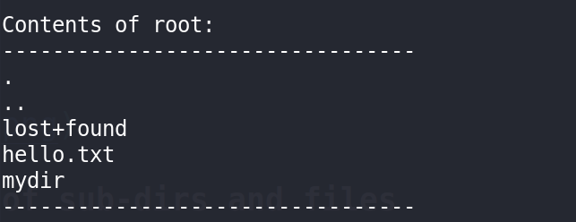

# Parsing an Ext2 File System

A simple C program to view the contents and other important parts of an ext2 disk image

## Usage
'''
chmod +x parse
./parse \<disk_image>
'''

## Reading Superblock and Block Group Descriptor

Every ext2 file system uses blocks as their basic means of storage. Blocks are just group of sectors. Block groups are group of blocks. Every (Not every actually) Block group contatins few divisions of blocks.

- Starting from 0 offset to 1024 is Superblock (Assuming 1024 is the block size)
This block stores the information/overview of the overall filesystem such as Block size, Inode size, Number of free blocks, Creator OS etc.
- Block Group Descriptor table starts right after the superblock. This block group descriptor table is an array of block group descriptors. These block group descriptors are just a structures which describes that particular block group.

Every block can be represented as structs.

Struct for Superblock:

Struct for BGD:

We can use fseek (or) lseek to move the pointer in the disk image file to print out the contents from that particular offset.
I used fseek() as it is convinent for me (I don't like those file descriptors :P)

(Also in the given disk images the inode size was 256 but in general inode size is 128 bytes for ext2)

**Outputs:**

## Reading contents in the root directory

- Each inode contains the information about a single file on the system. A file can be a directory, a socket, a buffer, character or block device, symbolic link or a regular file. So an inode can be seen as a block of information related to an entity, describing its location on disk, its size and its owner. 

To find the offset of a particular inode from starting of the file system we can use the bg_inode_table from block group desc which return the block number of the inode table in that particular block group.

So offset = (bg_inode_table) * BLOCK_SIZE + (inode_number-1) * INODE_SIZE

After figuring out the inode, we can use i_block[15] to find out the files in the root dir.

**Output:**

## Reading contents of sub-dirs and files

I have not implemented this part properly but I just call the read_dir function recursively to print out the files in sub-dirs and content in a regular file.

This seems correct but Im sure that Im missing somewhere.
This logic works for disk1.img but not for disk2.img and foe the contents it works for disk2.img but not for disk1.img (pretty lame ryt)

